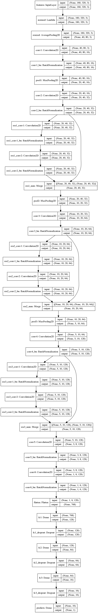
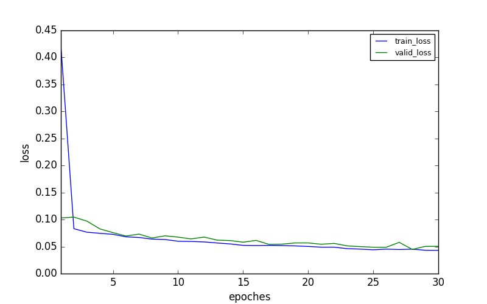

# Behavioral Cloning Project Documentation

## Data preparation

The car was trained in both tracks, and the training dataset consist of records of about several laps of normal, centerline driving and records of recovering from either left or right road side. Additionally, a testing dataset with only records of normal driving in the first track were created to evaluate the trained model. 

A `data_generator` function was designed to generate batches of image arrays and labels from the \<csv log file\>. In model training process, the original training dataset were split into train/valid parts with a proportion of 0.8:0.2. And a simple data augmentation technique that **left-right flipping both images and steering angles** was adopted. Also, left, right and center camera images were all used in training. Thus, in training process, the `data_generator` will provide batches of left-right flipped and multi-camera image arrays and steering angles. While in evaluating the model on testing dataset, the `data_generator` will only provide center camera images without left-right flipping.

Note that the `data_generator` will not do data preprocessing. Image resizing operation as well as normalization are integrated in the model architechture.

## Network architechture

I designed a resnet-like neural network. The architechture consists of three major parts, **preprocessing layers, feature learning layers and regression layers**. The input features are just image arrays, and the output preditions are steering angles. I should have tried to modify the network to predict both steering angles and throttles, however, since the throttle mainly remained to be just constant 1 when I drive the car, I would just predict angles and set the throttle to be 1 in the `drive.py` script. Descriptions of the architechture are as below.

- The preprocessing layers are designed for image preprocessing, including normalization and resizing operation. A `Lambda` layer was used to insert the normalization function. An `AveragePooling2D` layer was adopted to resize the camera image from shape (160, 320, 3) to (40, 80, 3).
- The feature learning layers are designed for feature extraction purpose, they should extract features like road edges after sufficient learning. These layers include 3 residual blocks (`res_block`) and a total of 12 `Convolution2D` layers. A `res_block` consists of two `Convolutional2D` layer. Each `Convolution2D` layer is followed by a `BatchNormalization` layer, for training acceleration， normalization and regularization. Except `conv1` using a 5x5 kernel, rest convolutional layers all take 3x3 filters. Detailed structure is shown in the figure below.
- The regression layers are going to learn how to predict steering angles. They are simply 4 fully connected `Dense` layers. `Dropout` layers are added to prevent overfitting. This part is much like the structure in the Nvidia paper.

When using convolutional and fully connected layers, I adopted an activation method of `relu` to each of them and I also added a L2 weight decay to their weights to prevent overfitting. 

I plotted the model architechture with layer shape shown using keras, as the figure below.


## Model training

I adopted the `mse` loss and the `Adam` optimizer for the model. If firstly training from scratch, the starting learning rate (lr) is set to be the default value of 0.001. While fine tuning a pre-trained model, the starting lr is set to be 0.0001.
Some hyperparameters are as follows.

```python
batch_size = 128  # It used about 2G GPU RAM
epoches = 30  # 
start_lr = 0.001
fine_tune_lr = 1e-4
l2_weight_decay = 1e-5
```
In my previous trivals, I used a SGD optimizer when fine tuning the model, but the converging process didn't seem better than that of an Adam optimizer. Instead of fine tuning SGD learning rate when fine tuning the model, I just took Adam again with a lower starting learning rate.

When training, the train_loss and val_loss both decreased with minor distances. This means the model did learn without overfitting. And sometimes the val_loss was lower than train_loss in some epoches, probably because of no dropout operations during validation. One thing to note is that the final `mse` loss doesn't strictly indicate the perfomance of driving behavior. I took the provided sample data for training, the final loss was very small, but in simulating, the car sometimes go off the road, this may due to inadequte training data teaching the car how to go back road. Anyway, after some training and fine tuning, the loss on the testing dataset went to a small value. Below is a sample training log: 

## Model evaluatation and simulation tests

The final model gives a loss of `???` on the testing dataset. It's good enough to ensure safe driving in simulation tests, though sometimes the car just looks like drunk driving. I believe that behaviors of the car can be improved by better teaching. The model architechture is just good enough. Here I present some predictions of sample data.
